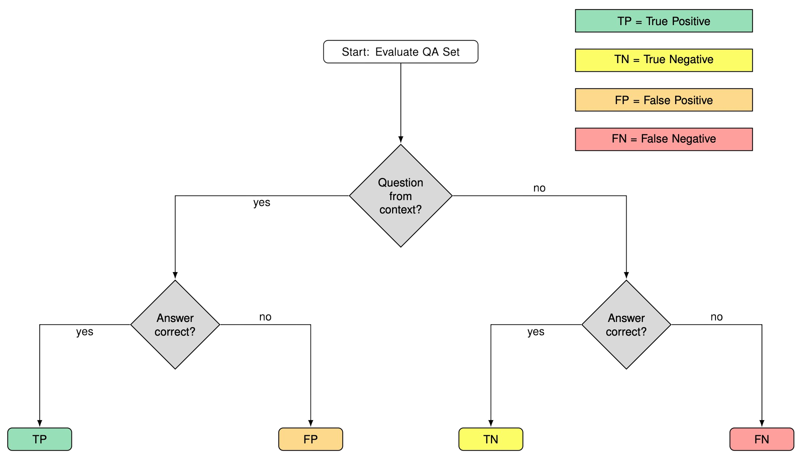

## Citation

More details about the RetChemQA are given in the following preprint:

> *Single and Multi-Hop Question-Answering Datasets for Reticular Chemistry with GPT-4-Turbo*  
> Nakul Rampal, Kaiyu Wang, Matthew Burigana, Lingxiang Hou, Juri Al-Johani, Anna Sackmann, Hanan S. Murayshid, Walaa A. AlSumari, Arwa M. AlAbdulkarim, Nahla E. AlHazmi, Majed O. Alawad, Christian Borgs[^1], Jennifer T. Chayes[^2], Omar M. Yaghi[^3]  
> [https://arxiv.org/abs/2405.02128](https://arxiv.org/abs/2405.02128)  

[^1]: Corresponding author (email: borgs@berkeley.edu)
[^2]: Corresponding author (email: jchayes@berkeley.edu)
[^3]: Corresponding author (email: yaghi@berkeley.edu)

## Evaluation

Each Q&A pair in a subset of RetChemQA dataset has been evaluated based on the following criteria: 

## License 

The dataset is distributed under the MIT open source license (see [`LICENSE.txt`](LICENSE.txt))

## Contributing

If you have any questions/comments/feedback, please feel free to reach out to any of the authors.

In addition, if you have any new feature requests or if you find any bugs, please open a new [issue](https://github.com/nakulrampal/RetChemQA/issues).

Some issues we have encountered include (i) questions being generated from unrelated sections of a PDF, and (ii) incomplete processing of PDFs, which results in Q&A pairs being generated from only a small portion of the text.

## Acknowledgements

We acknowledge the financial support from the following sources:
1. Bakar Institute of Digital Materials for the Planet (BIDMaP)

